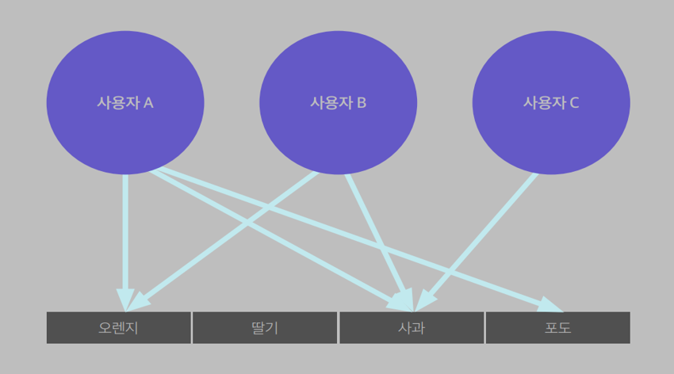
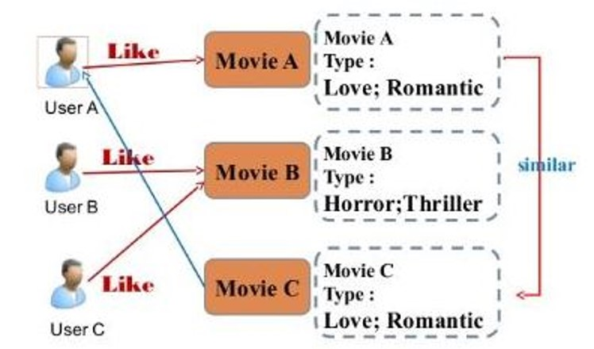

# 세미 프로젝트 - 영화 추천(movie Recommendation)

## 1. 시작

> 4차산업혁명 서비스 빅데이터 실무 과정  세미프로젝트 주제로 영화추천을 하기로 하였다.  

### (1) 검색

>  영화 추천을 만들기 위하여 영화 추천에 사용할 데이터를 검색하였다. 구글과 kaggle에서 다음과 같은 데이터를 찾았다.

### kaggle 

- **NetFlix Prize Data**
  - `movie_titles.csv`
  - `combined_data_1.txt`
  - `combined_data_2.txt`
  - `combined_data_3.txt`
  - `combined_data_4.txt`

- **The Movies Dataset**
  - `movies_metadata`
  - `ratings`
  - `ratings_small`

#### 추천 방법

- **추천 시스템** 이란?
  - 사용자의 취향이나 선호의 기반으로 정보를 선별하여 사용자에게 적합한 특정 항목을 선택(information filtering)하여 제공하는 시스템을 일컫는다. (정인용, 양새동, 정회경, “A Study on Movies Recommendation System of Hybrid Filtering-Based”, *Journal of the Korea Institute of Information and Communication* Engineering  Vol. 19, No. 1, January 2015, pp. 113-118)
  - 추천 시스템에는 협업 필터링, 콘텐츠 기반 필터링, 그리고 Hybrid 필터링이 있다.

- 우리 팀이 원한 최종 추천 방법은 **하이브리드(Hybird) 추천 시스템(Hybrid 필터링)** 이다.

##### 하이브리드 추천 시스템이란?

**하이브리드 추천 시스템**은 협업 필터링과 콘텐츠 기반 필터링이 상호 보안적으로 합쳐진 알고리즘이다.

- **협업필터링**이란?

  - 대규모의 기존 사용자 행동 정보를 분석하여 해당 사용자와 비슷한 성향의 사용자들이 기존에 좋아했던 항목을 추천하는 기술이다.
  - 예를 들어, 사용자 A와 사용자 B가 사과와 오렌지를 같이 구매했으므로, 사과를 구매한 사용자 C에게 오렌지를 추천한다.
  - 
  - **협업 필터링**의 단점
    1. 콜드 스타트 (Clod Start) : 다중 사용자들이 기존 아이템에 대해 평가한 선호도를 기반으로 다음 아이템을 추천하는데, 만약 새로운 아이템이 추가 되었을 때 이 아이템이 사용자들로부터 평가를 받기까지 즉, 다음 추천을 위한 충분한 데이터가 쌓일 때 까지 오랜 시간이 필요하다.
    2. 롱테일(Long Tail) : 선택권이 많다 해도 사용자들은 소수 인기 항목들에 편향되는 단점이 있다. 그래서 데이터는 점점 더 양극화 되고 결국 비교적 좋은 아이템이 있어도 추천을 할 수 있는 기반 데이터가 적어 문제를 야기한다.

  

- **콘텐츠 기반 필터링**이란?
  
  - 협업 필터링이 사용자의 행동 기록을 이용하는 반면, 콘텐츠 기반 필터링은 항목 자체를 분석하여 추천을 구현한다. 예를 들어 음악을 추천하기 위해 음악 자체를 분석하여 유사한 음악을 추천하는 방식이다. (서봉원, “콘텐츠 추천 알고리즘의 진화”, *Broadcasting* *Trend & Insight* Vol. 5, No. 1, April 2016, pp. 19-24)
  - **콘텐츠 기반 필터링**의 단점
    1. 다양한 형식 추천 어려움 : 모델 특성상 콘텐츠들을 분석하고 특징들을 카테고리화 시켜 데이터로 저장하고 이를 추천에 사용한다. 하지만 다양한 형식의 아이템이 추가되면 상이한 형식의 아이템들의 특징을 통일시키기 어렵다. 예를 들어, 비디오와 사진은 다른 아이템 형식으로 서로 다른 특징들을 가지고 있고 얻을 수 있는 정보가 달라 프로파일 구성이 어렵다. (서봉원, “콘텐츠 추천 알고리즘의 진화”, *Broadcasting* *Trend & Insight* Vol. 5, No. 1, April 2016, pp. 19-24)
  2. 낮은 정확도 : 협업 필터링과 비교했을 때 더 낮은 정확도를 보인다.
  
- 다시 **하이브리드**로 돌아오면, 사용자 평점 기반 데이터에 콘텐츠 기반 데이터(ex. 특징들)의 가중치를 주고 두개를 합산하여 좀 더 정확한 결과를 낼 수 있는 모델이다.
- 최종적으로 콜드 스타트를 방지하기 위해 신규 아이템에 대해서는 콘텐츠 기반 가중치가 보완 역할을 하고, 반대로 콘텐츠 기반 필터링의 단점은 협업 필터링 모델로 상쇄하는 상호 보완적인 알고리즘 모델이다.




## 2. 데이터 선별

### (1) NetFlix Prize Data vs The Movies Dataset

- 초기에 `NetFlix Prize Data`를 사용할 것으로 계획하였지만 이 데이터 셋은 사용자 평점 기반이 중심이 되고 하이브리드에 사용할 수 있는 콘텐츠 기반 요소가 '장르' 하나 뿐이었다.  
- 반면에 `The Movies Dataset`은 장르뿐만 아니라 사용자 평점도 있고 하이브리드에 사용할 수 있는 요소들이 많았다. 그래서 The Movies Dataset을 이용하여 분석하기로 하였다.


### (2) The Movies Dataset

#### `movies_metadata`

- `movies_metadata`에는 가중치를 줄 수 있는 변수들이 더 많았다. 
  - 총 24개의 컬럼들을 가지고 있다.
  - 우리 팀이 사용할 컬럼은 `genres`, `id`, `original_language`, `original_title`, `popularity`, `release_date`, `vote_average`, `vote_count`이다.

| adult | belongs_to_collection                                        | budget   | genres                                                       | homepage                             | id   | imdb_id   | original_language | original_title | overview                                                     | popularity | poster_path                      | production_companies                            | production_countries                                        | release_date | revenue  | runtime | spoken_languages                         | status   | tagline | title     | video | vote_average | vote_count |
| ----- | ------------------------------------------------------------ | -------- | ------------------------------------------------------------ | ------------------------------------ | ---- | --------- | ----------------- | -------------- | ------------------------------------------------------------ | ---------- | -------------------------------- | ----------------------------------------------- | ----------------------------------------------------------- | ------------ | -------- | ------- | ---------------------------------------- | -------- | ------- | --------- | ----- | ------------ | ---------- |
| FALSE | {'id': 10194, 'name': 'Toy Story Collection', 'poster_path': '/7G9915LfUQ2lVfwMEEhDsn3kT4B.jpg', 'backdrop_path': '/9FBwqcd9IRruEDUrTdcaafOMKUq.jpg'} | 30000000 | [{'id': 16, 'name':  'Animation'}, {'id': 35, 'name': 'Comedy'}, {'id': 10751, 'name': 'Family'}] | http://toystory.disney.com/toy-story | 862  | tt0114709 | en                | Toy Story      | Led by Woody, Andy's toys live happily in his  room until Andy's birthday brings Buzz Lightyear onto the scene. Afraid of  losing his place in Andy's heart, Woody plots against Buzz. But when  circumstances separate Buzz and Woody from their owner, the duo eventually  learns to put aside their differences. | 21.94694   | /rhIRbceoE9lR4veEXuwCC2wARtG.jpg | [{'name': 'Pixar Animation Studios', 'id':  3}] | [{'iso_3166_1': 'US', 'name': 'United States  of America'}] | #######      | 3.74E+08 | 81      | [{'iso_639_1': 'en', 'name': 'English'}] | Released |         | Toy Story | FALSE | 7.7          | 5415       |


#### `ratings_small`

- `ratings`로 분석하려고 했지만 코랩에서 돌리면 세션이 강제 종료되는 현상이 발생하여 `ratings_small`로 분석하기로 하였다.

| userId | movieId | rating | timestamp |
| ------ | ------- | ------ | --------- |
| 1      | 31      | 2.5    | 1.26E+09  |


## 3. 코딩

### (1) 코드

> 모든 코드와 구현은 코랩에서 진행하였습니다.

- 사용자 영화 추천 코드들을 검색하여 참고하였고, 우리 팀에 맞춰서 코드를 재작성 하였다. 

#### 1. 필요한 패키지 설치와  패키지 불러오기

```python
!pip install surprise
!pip install tmdbv3api

import pandas as pd
import numpy as np 
import math 
import re 
from scipy.sparse import csr_matrix   
import matplotlib.pyplot as plt 
import seaborn as sns 
from surprise import Reader, Dataset, SVD, NormalPredictor, KNNBasic
from surprise import KNNWithMeans, KNNWithZScore, KNNBaseline
from surprise import BaselineOnly, SVDpp,NMF, SlopeOne, CoClustering
from surprise.accuracy import rmse
from surprise import accuracy
from surprise.model_selection import cross_validate, KFold, train_test_split
import json
import mpmath
from scipy.special import logsumexp
```

- `surprise`는 통계 함수 알고리즘들을 실행하기 위해 필요한 패키지이며, 우리 팀 추천 시스템에 핵심 패키지이다.

#### 2. 전처리 과정

##### (1) `ratings_smaill`데이터 불러오기

```python
ratings = pd.read_csv('../content/drive/My Drive/ratings_small.csv',low_memory=False)
ratings = ratings[['userId', 'movieId', 'rating']]
ratings.head()
ratings.movieId = pd.to_numeric(ratings.movieId, errors='coerce')
ratings.userId = pd.to_numeric(ratings.userId, errors='coerce')
ratings.rating = pd.to_numeric(ratings.rating, errors='coerce')
len(ratings)
df = ratings
print(df)
```

```
        userId  movieId  rating
0            1       31     2.5
1            1     1029     3.0
2            1     1061     3.0
3            1     1129     2.0
4            1     1172     4.0
...        ...      ...     ...
99999      671     6268     2.5
100000     671     6269     4.0
100001     671     6365     4.0
100002     671     6385     2.5
100003     671     6565     3.5

[100004 rows x 3 columns]
```

1. `ratings_small`데이터를 불러와서 필요한 컬럼들만 추출한다.
2. 그 다음 데이터 형식을 숫자로 바꿔준다.

##### (2) `user`와 `movie`와 `ratings`의 개수 파악

```python
p = df.groupby('rating')['rating'].agg(['count'])
movie_count = df['movieId'].nunique()
cust_count = df['userId'].nunique()
rating_count = df['userId'].count()
df = df[pd.notnull(df['rating'])]
```

1. `nunique()`와 `count()`를 이용하여 영화, 사용자, 별점의 개수를 구해준다.
2. 그 다음 별점 컬럼에 결측값이 없는 것들만 다시 `df`로 만들어 준다.

##### (3) `user`와 `movie`의 구간 정하기

```python
f = ['count','mean']
df_movie_summary = df.groupby('movieId')['rating'].agg(f)
df_movie_summary.index = df_movie_summary.index.map(int) # map 함수 쓰면 한번에 형변환 처리 가능 , 스트나 튜플을 지정함수로 처리해주는 역할
movie_benchmark = round(df_movie_summary['count'].quantile(0.7),0)  #quantile 사분위수
drop_movie_list = df_movie_summary[df_movie_summary['count'] < movie_benchmark].index
print('Movie minimum times of review: {}'.format(movie_benchmark))
```

```
Movie minimum times of review: 7.0
```

```python
df_cust_summary = df.groupby('userId')['rating'].agg(f)
df_cust_summary.index = df_cust_summary.index.map(int)
cust_benchmark = round(df_cust_summary['count'].quantile(0.7),0)
drop_cust_list = df_cust_summary[df_cust_summary['count'] < cust_benchmark].index
print('Customer minimum times of review: {}'.format(cust_benchmark))
```

```
Customer minimum times of review: 138.0
```

```python
df = df[~df['movieId'].isin(drop_movie_list)]
df = df[~df['userId'].isin(drop_cust_list)]
```

1. 리뷰가 적은 영화와 영화를 적게본 유저들을 걸러내야 더 정확하게 추천해줄 수 있다. 최소한의 구간을 정해 데이터를 만드는 작업이다.

##### (4) 피벗테이블 만들기

```python
df_p = pd.pivot_table(df,values='rating',index='userId',columns='movieId')
print(df_p)
```

```
movieId  1       2       3       4       ...  139644  142488  148626  152081
userId                                   ...                                
4           NaN     NaN     NaN     NaN  ...     NaN     NaN     NaN     NaN
15          2.0     2.0     NaN     NaN  ...     3.0     3.5     3.5     3.0
17          NaN     NaN     NaN     NaN  ...     NaN     NaN     NaN     NaN
19          3.0     3.0     3.0     3.0  ...     NaN     NaN     NaN     NaN
21          NaN     NaN     NaN     NaN  ...     NaN     NaN     NaN     NaN
...         ...     ...     ...     ...  ...     ...     ...     ...     ...
652         NaN     NaN     NaN     NaN  ...     NaN     NaN     NaN     NaN
654         5.0     3.0     NaN     NaN  ...     NaN     NaN     NaN     NaN
659         NaN     NaN     NaN     NaN  ...     NaN     NaN     NaN     NaN
664         3.5     NaN     NaN     NaN  ...     NaN     NaN     NaN     NaN
665         NaN     3.0     3.0     NaN  ...     NaN     NaN     NaN     NaN

[202 rows x 2794 columns]
```

1. 피벗테이블로 만들면 유저의 평점으로 상관관계를 만들어 추천해줄 수 있다. 또한 ALS 알고리즘도 사용 가능하다.

##### (5) `movies_metadata` 불러오기

```python
meta = pd.read_csv('../content/drive/My Drive/movies_metadata.csv',low_memory=False)
meta = meta[['id', 'original_title', 'genres','release_date','popularity','original_language']]
meta = meta.rename(columns={'id':'movieId'})
meta.movieId = pd.to_numeric(meta.movieId, errors='coerce')
meta.popularity = pd.to_numeric(meta.popularity, errors='coerce')   
```

1. `movies_metadata`에서도 필요한 컬럼들을 추출하였다.
2. id를 movieId로 바꿔준것은 `ratings_smaill`의 movieId와 나중에 결합해야하기 때문이다.
3. 데이터 형식을 숫자로 바꿔주었다.


#### 3. 필요한 함수와 알고리즘 구현부

> 팀원 한 명씩 본인이 원하는 컬럼으로 가중치를 주기로 하였다. 가중치 주는 함수를 만들어 비교 분석하려고 한다.

##### (1) 개봉일 가중치 함수

```python
def user_release_ratio(df, usernumber):
    user_df =df[df['userId'] == usernumber]
    meta2 = pd.read_csv('../content/drive/My Drive/movies_metadata.csv',low_memory=False)
    value_meta = meta2[['id','original_title','release_date', 'genres']]

    value_meta = value_meta.rename(columns={'id':'movieId'})
    value_meta.movieId = pd.to_numeric(value_meta.movieId, errors='coerce')
    value_meta = value_meta.dropna(axis=0)
    value_meta = value_meta.reset_index()
    merge_data = pd.merge(user_df, value_meta, on='movieId', how='left')
    merge_data = merge_data.dropna(axis=0)
    merge_data = merge_data.reset_index()

    release_date_list = {'1900':0,'1950':0,'1960':0,'1970':0,'1980':0,'1990':0,'2000':0,'2010':0,'2020':0}
    for i in range(0,len(merge_data)):
        if int(merge_data['release_date'].loc[i][0:4]) <= 1900:
            release_date_list["1900"] += 1
        elif int(merge_data['release_date'].loc[i][0:4]) <= 1950:
            release_date_list["1950"] += 1
        elif int(merge_data['release_date'].loc[i][0:4]) <= 1960:
            release_date_list["1960"] += 1
        elif int(merge_data['release_date'].loc[i][0:4]) <= 1970:
            release_date_list["1970"] += 1
        elif int(merge_data['release_date'].loc[i][0:4]) <= 1980:
            release_date_list["1980"] += 1
        elif int(merge_data['release_date'].loc[i][0:4]) <= 1990:
            release_date_list["1990"] += 1
        elif int(merge_data['release_date'].loc[i][0:4]) <= 2000:
            release_date_list["2000"] += 1
        elif int(merge_data['release_date'].loc[i][0:4]) <= 2010:
            release_date_list["2010"] += 1
        elif int(merge_data['release_date'].loc[i][0:4]) <= 2020:
            release_date_list["2020"] += 1
    release_date_list

    sum = 0
    for i in release_date_list:

        sum += release_date_list[i]

    release_date_rate = []
    for i in release_date_list:
        if release_date_list[i] ==0:
            continue
        release_date_list[i] = round((release_date_list[i]/sum),3)
    return release_date_list
```

1. `개봉일`에 가중치를 주는 함수이다. 
2. **User**가 본 영화에서 `개봉일`의 구간을 나누어 그 구간에 해당하는 개수를 구한다. 
3. 그 다음에 해당 `연도`의 개수와 총 개수로 나누어서 몇 %를 차지하고 있는지 구하고 `연도` 구간에 값을 재할당한다.

##### (2) 개봉일 가중치에 예측치 더하는 함수

> 여기서 Estimate_Score는 SVD() 알고리즘을 사용하여 나온 결과값이다. 이 예측값에 가중치를 더해 최종 추천순위를 만든다.

```python
def Estimate_Score_sum1(user_df, user_release_ratio_list):
    user_df = user_df.dropna(axis=0)
    for i in range(0,len(user_df)):
        if int(user_df.iloc[i]['release_date'][0:4]) <= 1900:
            user_df['Estimate_Score'].loc[user_df.index[i]] = user_df.iloc[i]['Estimate_Score'] + user_release_ratio_list['1900']
        elif int(user_df.iloc[i]['release_date'][0:4]) <= 1950:
            user_df['Estimate_Score'].loc[user_df.index[i]]= user_df.iloc[i]['Estimate_Score'] + user_release_ratio_list['1950']
        elif int(user_df.iloc[i]['release_date'][0:4]) <= 1960:
            user_df['Estimate_Score'].loc[user_df.index[i]] = user_df.iloc[i]['Estimate_Score'] + user_release_ratio_list['1960']
        elif int(user_df.iloc[i]['release_date'][0:4]) <= 1970:
            user_df['Estimate_Score'].loc[user_df.index[i]] = user_df.iloc[i]['Estimate_Score'] + user_release_ratio_list['1970']
        elif int(user_df.iloc[i]['release_date'][0:4]) <= 1980:
            user_df['Estimate_Score'].loc[user_df.index[i]] = user_df.iloc[i]['Estimate_Score'] + user_release_ratio_list['1980']
        elif int(user_df.iloc[i]['release_date'][0:4]) <= 1990:
            user_df['Estimate_Score'].loc[user_df.index[i]] = user_df.iloc[i]['Estimate_Score'] + user_release_ratio_list['1990']
        elif int(user_df.iloc[i]['release_date'][0:4])  <= 2000:
            user_df['Estimate_Score'].loc[user_df.index[i]] = user_df.iloc[i]['Estimate_Score'] + user_release_ratio_list['2000']
        elif int(user_df.iloc[i]['release_date'][0:4])  <= 2010:
            user_df['Estimate_Score'].loc[user_df.index[i]] = user_df.iloc[i]['Estimate_Score'] + user_release_ratio_list['2010']
        elif int(user_df.iloc[i]['release_date'][0:4])  <= 2020:
            user_df['Estimate_Score'].loc[user_df.index[i]] = user_df.iloc[i]['Estimate_Score'] + user_release_ratio_list['2020']
    return user_df
```

1. **User**에게 추천해줄 영화에 위에서 구한 `연도` 가중치를 더해준다. 
2. 만약 **User**에게 **A**라는 영화를 추천해줄 때 그 영화가 2012년 영화면 2020에 저장된 값을 더해주는 것이다.

##### (3) 인기 가중치 함수

```python
def user_pop_ratio(df, usernumber):
    user_df =df[df['userId'] == usernumber]
    meta2 = pd.read_csv('../content/drive/My Drive/movies_metadata.csv',low_memory=False)
    value_meta = meta2[['id','original_title', 'popularity','genres']]

    value_meta = value_meta.rename(columns={'id':'movieId'})
    value_meta.movieId = pd.to_numeric(value_meta.movieId, errors='coerce')
    value_meta.popularity = pd.to_numeric(value_meta.popularity, errors='coerce') 
    value_meta = value_meta.dropna(axis=0)
    value_meta = value_meta.reset_index()
    merge_data = pd.merge(user_df, value_meta, on='movieId', how='left')
    merge_data = merge_data.dropna(axis=0)
    merge_data = merge_data.reset_index()

    popularity_list = {'2':0,'6':0,'9':0,'13':0,'18':0,'31':0,'64':0,'185':0,'288':0, '547':0}
    for i in range(0,len(merge_data)):
        if int(merge_data['popularity'].loc[i]) <= 2:
            popularity_list["2"] += 1
        elif int(merge_data['popularity'].loc[i]) <= 6:
            popularity_list["6"] += 1
        elif int(merge_data['popularity'].loc[i]) <= 9:
            popularity_list["9"] += 1
        elif int(merge_data['popularity'].loc[i]) <= 13:
            popularity_list["13"] += 1
        elif int(merge_data['popularity'].loc[i]) <= 18:
            popularity_list["18"] += 1
        elif int(merge_data['popularity'].loc[i]) <= 31:
            popularity_list["31"] += 1
        elif int(merge_data['popularity'].loc[i]) <= 64:
            popularity_list["64"] += 1
        elif int(merge_data['popularity'].loc[i]) <= 185:
            popularity_list["185"] += 1
        elif int(merge_data['popularity'].loc[i]) <= 288:
            popularity_list["288"] += 1
        elif int(merge_data['popularity'].loc[i]) <= 547:
            popularity_list["547"] += 1
    # popularity_list

    sum = 0
    for i in popularity_list:

        sum += popularity_list[i]

    #popularity_list = []
    for i in popularity_list:
        if popularity_list[i] ==0:
            continue
        popularity_list[i] = round((popularity_list[i]/sum),3)
    return popularity_list
```

1. 개봉일과 똑같은 방식으로 **User**가 본 영화들의 인기를 구간으로 나눈다.
   1. 여기서 인기는 `일일 집계 투표 수`, `일일 조회수`, `일일 유저들이 ‘가장 좋아하는 영화’ 리스트에 넣은 집계`, `일일 유저들이 ‘나중에 볼 영화’ 리스트에 넣은 집계`,`개봉일`, `전체투표수` 들을 고려해 나온 점수이다.

2. 그 다음에 해당 `인기` 개수와 총 개수로 나누어서 몇 %를 차지하고 있는지 구하고 `인기` 구간에 값을 재할당한다.

##### (4) 인기 가중치에 예측치를 더하는 함수

```python
def Estimate_Score_sum2(user_df, user_pop_ratio_list):
    user_df = user_df.dropna(axis=0)
    for i in range(0,len(user_df)):
        if int(user_df.iloc[i]['popularity']) <= 2:
            user_df['Estimate_Score'].loc[user_df.index[i]] = user_df.iloc[i]['Estimate_Score'] + user_pop_ratio_list['2']
        elif int(user_df.iloc[i]['popularity']) <= 6:
            user_df['Estimate_Score'].loc[user_df.index[i]] = user_df.iloc[i]['Estimate_Score'] + user_pop_ratio_list['6']
        elif int(user_df.iloc[i]['popularity']) <= 9:
            user_df['Estimate_Score'].loc[user_df.index[i]] = user_df.iloc[i]['Estimate_Score'] + user_pop_ratio_list['9']
        elif int(user_df.iloc[i]['popularity']) <= 13:
            user_df['Estimate_Score'].loc[user_df.index[i]] = user_df.iloc[i]['Estimate_Score'] + user_pop_ratio_list['13']
        elif int(user_df.iloc[i]['popularity']) <= 18:
            user_df['Estimate_Score'].loc[user_df.index[i]] = user_df.iloc[i]['Estimate_Score'] + user_pop_ratio_list['18']
        elif int(user_df.iloc[i]['popularity']) <= 31:
            user_df['Estimate_Score'].loc[user_df.index[i]] = user_df.iloc[i]['Estimate_Score'] + user_pop_ratio_list['31']
        elif int(user_df.iloc[i]['popularity'])  <= 64:
            user_df['Estimate_Score'].loc[user_df.index[i]] = user_df.iloc[i]['Estimate_Score'] + user_pop_ratio_list['64']
        elif int(user_df.iloc[i]['popularity'])  <= 185:
            user_df['Estimate_Score'].loc[user_df.index[i]] = user_df.iloc[i]['Estimate_Score'] + user_pop_ratio_list['185']
        elif int(user_df.iloc[i]['popularity'])  <= 288:
            user_df['Estimate_Score'].loc[user_df.index[i]] = user_df.iloc[i]['Estimate_Score'] + user_pop_ratio_list['288']
        elif int(user_df.iloc[i]['popularity'])  <= 547:
            user_df['Estimate_Score'].loc[user_df.index[i]] = user_df.iloc[i]['Estimate_Score'] + user_pop_ratio_list['547']
    return user_df
```

1. **User**에게 추천해줄 영화에 위에서 구한 `인기` 가중치를 더해준다. 
2. 만약 **User**에게 **A**라는 영화를 추천해줄 때 그 영화의 `인기`가 190이라면 288 구간의 값을 더해주는 것이다.

##### (5) 영화 언어 가중치 함수

```python
def user_language_ratio(df, usernumber):
    user_df =df[df['userId'] == usernumber]
    meta2 = pd.read_csv('../content/drive/My Drive/movies_metadata.csv',low_memory=False)
    value_meta = meta2[['id','original_title', 'original_language','genres']]

    value_meta = value_meta.rename(columns={'id':'movieId'})
    value_meta.movieId = pd.to_numeric(value_meta.movieId, errors='coerce')
    # value_meta.popularity = pd.to_numeric(value_meta.popularity, errors='coerce') 
    value_meta = value_meta.dropna(axis=0)
    value_meta = value_meta.reset_index()
    merge_data = pd.merge(user_df, value_meta, on='movieId', how='left')
    merge_data = merge_data.dropna(axis=0)
    merge_data = merge_data.reset_index()

    original_language_list = {'en':0,'fr':0,'it':0,'ja':0,'de':0}
    for i in range(0,len(merge_data)):
        if merge_data['original_language'].loc[i] == 'en':
            original_language_list["en"] += 1
        elif merge_data['original_language'].loc[i] == 'fr':
            original_language_list["fr"] += 1
        elif merge_data['original_language'].loc[i] == 'it':
            original_language_list["it"] += 1
        elif merge_data['original_language'].loc[i] == 'ja':
            original_language_list["ja"] += 1
        elif merge_data['original_language'].loc[i] == 'de':
            original_language_list["de"] += 1
       
    # original_language_list

    sum = 0
    for i in original_language_list:

        sum += original_language_list[i]

    # popularity_list = []
    for i in original_language_list:
        if original_language_list[i] ==0:
            continue
        original_language_list[i] = round((original_language_list[i]/sum),3)

    return original_language_list
```

1. `개봉일`, `인기`와 같은 방식으로 **User**가 본 영화의 `언어`를 나누어 가중치를 준다. 
2. 그 다음 해당 `언어` 개수와 총 개수를 나누어 몇 %를 차지하고 있는지 구하고 `언어`에 값을 재할당한다.

##### (6) 언어 가중치에 예측치를 더하는 함수

```python
def Estimate_Score_sum3(user_df, user_language_ratio_list):
    user_df = user_df.dropna(axis=0)
    for i in range(0,len(user_df)):
        if user_df.iloc[i]['original_language'] == 'en':
            user_df['Estimate_Score'].loc[user_df.index[i]] = user_df.iloc[i]['Estimate_Score'] + user_language_ratio_list['en']
        elif user_df.iloc[i]['original_language'] == 'fr':
            user_df['Estimate_Score'].loc[user_df.index[i]] = user_df.iloc[i]['Estimate_Score'] + user_language_ratio_list['fr']
        elif user_df.iloc[i]['original_language'] == 'it':
            user_df['Estimate_Score'].loc[user_df.index[i]] = user_df.iloc[i]['Estimate_Score'] + user_language_ratio_list['it']
        elif user_df.iloc[i]['original_language'] == 'ja':
            user_df['Estimate_Score'].loc[user_df.index[i]] = user_df.iloc[i]['Estimate_Score'] + user_language_ratio_list['ja']
        elif user_df.iloc[i]['original_language'] == 'de':
            user_df['Estimate_Score'].loc[user_df.index[i]] = user_df.iloc[i]['Estimate_Score'] + user_language_ratio_list['de']
       
    return user_df
```

1. **User**에게 추천해줄 영화에 위에서 구한 언어 가중치를 더해준다. 
2. 만약 **User**에게 **A**라는 영화를 추천해줄 때 그 영화의 언어가 `en`이라면  `en`의 값을 더해주는 것이다.

##### (7) 평점과 평점에 투표한 수 가중치 함수

> 위 3개의 함수와 조금 다른 방식으로 진행하였습니다.
>
> > 내가 맡아서 한 가중치 부분이다.

```python
def user_vote_ratio():
  meta = pd.read_csv('../content/drive/My Drive/movies_metadata.csv',low_memory=False)
  meta = meta[['id', 'original_title', 'genres','poster_path','vote_average','vote_count']]
  meta = meta.rename(columns={'id':'movieId'})
  meta.movieId = pd.to_numeric(meta.movieId, errors='coerce')
  meta.head()
  meta.vote_average =  pd.to_numeric(meta.vote_average, errors='coerce')
  meta.vote_count =  pd.to_numeric(meta.vote_count, errors='coerce')
  meta = meta[['movieId','original_title','poster_path','vote_average','vote_count','genres']].dropna() 
  mata = meta.reset_index(inplace=True,drop=True)
  meta.index = meta.index.map(int)
  
  meta['vote_round'] = ''  
  meta['Adj'] = '' 
  meta.movieId = meta.movieId.astype(int)
  meta.vote_average = meta.vote_average.astype(float)
  meta.vote_count = meta.vote_count.astype(int)
  print(meta.head())
  meta.info() 
  meta.describe()
  
  for idx in range(len(meta)):
      if str(meta.vote_average[idx])[-1] in ["1","2","3","4","6","7","8","9"]:
        meta.vote_round[idx] = round(meta.vote_average[idx],0)
      else:
        meta.vote_round[idx] = meta.vote_average[idx]
  
  
  for idx in range(len(meta)):
      if len(str(meta.vote_count[idx])) == 1:
          meta.Adj[idx] = 1.1 / 250
      if len(str(meta.vote_count[idx])) == 2:
        if str(meta.vote_count[idx])[0] == "1":
          meta.Adj[idx] = (meta.vote_average[idx] * 2.1) / 250
        if str(meta.vote_count[idx])[0] == "2":
          meta.Adj[idx] = (meta.vote_average[idx] * 2.2) / 250
        if str(meta.vote_count[idx])[0] == "3":
          meta.Adj[idx] = (meta.vote_average[idx] * 2.3) / 250
        if str(meta.vote_count[idx])[0] == "4":
          meta.Adj[idx] = (meta.vote_average[idx] * 2.4) / 250
        if str(meta.vote_count[idx])[0] == "5":
          meta.Adj[idx] = (meta.vote_average[idx] * 2.5) / 250
        if str(meta.vote_count[idx])[0] == "6":
          meta.Adj[idx] = (meta.vote_average[idx] * 2.6) / 250
        if str(meta.vote_count[idx])[0] == "7":
          meta.Adj[idx] = (meta.vote_average[idx] * 2.7) / 250
        if str(meta.vote_count[idx])[0] == "8":
          meta.Adj[idx] = (meta.vote_average[idx] * 2.8) / 250
        if str(meta.vote_count[idx])[0] == "9":
          meta.Adj[idx] = (meta.vote_average[idx] * 2.9) / 250
      if len(str(meta.vote_count[idx])) == 3:
        if str(meta.vote_count[idx])[0] == "1":
          meta.Adj[idx] = (meta.vote_average[idx] * 3.1) / 250
        if str(meta.vote_count[idx])[0] == "2":
          meta.Adj[idx] = (meta.vote_average[idx] * 3.2) / 250
        if str(meta.vote_count[idx])[0] == "3":
          meta.Adj[idx] = (meta.vote_average[idx] * 3.3) / 250
        if str(meta.vote_count[idx])[0] == "4":
          meta.Adj[idx] = (meta.vote_average[idx] * 3.4) / 250
        if str(meta.vote_count[idx])[0] == "5":
          meta.Adj[idx] = (meta.vote_average[idx] * 3.5) / 250
        if str(meta.vote_count[idx])[0] == "6":
          meta.Adj[idx] = (meta.vote_average[idx] * 3.6) / 250
        if str(meta.vote_count[idx])[0] == "7":
          meta.Adj[idx] = (meta.vote_average[idx] * 3.7) / 250
        if str(meta.vote_count[idx])[0] == "8":
          meta.Adj[idx] = (meta.vote_average[idx] * 3.8) / 250
        if str(meta.vote_count[idx])[0] == "9":
          meta.Adj[idx] = (meta.vote_average[idx] * 3.9) / 250
      if len(str(meta.vote_count[idx])) == 4:
        if str(meta.vote_count[idx])[0] == "1":
          meta.Adj[idx] = (meta.vote_average[idx] * 4.1) / 250
        if str(meta.vote_count[idx])[0] == "2":
          meta.Adj[idx] = (meta.vote_average[idx] * 4.2) / 250
        if str(meta.vote_count[idx])[0] == "3":
          meta.Adj[idx] = (meta.vote_average[idx] * 4.3) / 250
        if str(meta.vote_count[idx])[0] == "4":
          meta.Adj[idx] = (meta.vote_average[idx] * 4.4) / 250
        if str(meta.vote_count[idx])[0] == "5":
          meta.Adj[idx] = (meta.vote_average[idx] * 4.5) / 250
        if str(meta.vote_count[idx])[0] == "6":
          meta.Adj[idx] = (meta.vote_average[idx] * 4.6) / 250
        if str(meta.vote_count[idx])[0] == "7":
          meta.Adj[idx] = (meta.vote_average[idx] * 4.7) / 250
        if str(meta.vote_count[idx])[0] == "8":
          meta.Adj[idx] = (meta.vote_average[idx] * 4.8) / 250
        if str(meta.vote_count[idx])[0] == "9":
          meta.Adj[idx] = (meta.vote_average[idx] * 4.9) / 250
      if len(str(meta.vote_count[idx])) == 5:
        if str(meta.vote_count[idx])[0] == "1":
          meta.Adj[idx] = (meta.vote_average[idx] * 5.1) / 250
  
  meta['genres'] = meta['genres'].apply(parse_genres)

  data = pd.merge(ratings, meta, on='movieId', how='inner')
  data.info()  
  data.userId = data.userId.astype('int32') 
  data.movieId = data.movieId.astype('int32')
  data.rating	 = data.rating.astype('float32')
  data.vote_average = data.vote_average.astype('float32')
  data.vote_count = data.vote_count.astype('int32')
  data.vote_round = data.vote_round.astype(str).astype('float32')
  data.Adj = pd.to_numeric(data.Adj, errors='coerce').astype('float32')
  return data, meta
```

1. `movies_metadata`에서 필요한 부분을 다시 불러온다.
2. 그 다음 평점을 다음과 같은 구간으로 나눈다.
   1. 6.1이면 6.0으로 6.5면 그대로 6.5, 6.7이면 7로 반올림하여 6~7점대에 3개의 구간이 나누어진다.
   2. 이것을 모든 평점대에 적용해준다.

3. 평점에 투표수가 적으면 신뢰성이 떨어진다고 생각하였다. 그리하여 다음과 같이 구간을 나누었다.
   1. 투표수 자리수로 5개로 구간을 나누었다. 
      1. `describe`로` vote_count`의 최댓값을 확인한 후 진행하였다.
   2. 10~99는 2구간,100~999 3구간처럼 총 5구간까지 먼저 나누었다.
   3. 10과 98은 다르기 때문에 10이면 2.1을 98은 2.9를 주는 식으로 앞의 자리는 소수점으로 주어 가중치를 주었다.
   4. 그 다음 여러번 돌려 괜찮은 수가 나왔던 250으로 나누어준다.
4. 이 데이터를` ratings`와 `movieId`를 기준으로 합쳐준다.

##### (8) 장르 정리 함수

```python
def parse_genres(genres_str):
    genres = json.loads(genres_str.replace('\'', '"'))
    
    genres_list = []
    for g in genres:
        genres_list.append(g['name'])

    return genres_list
```

1. `Json` 형식으로 되어있는 장르를 정리하는 함수이다. 

##### (9) 평점과 평점에 투표한 수 가중치에 예측값을 더하는 함수

```python
def Estimate_Score_sum4(df_user,user_df):
  dfsort = df_user.groupby('vote_round')['vote_round'].agg(['count'])
  dfsort = dfsort.sort_values(by='count',ascending = False)
  dfsort["countAdj"] = ''
  dfsort['Rank'] = ''
  for idx in range(len(dfsort)):
    dfsort["countAdj"].iloc[idx] = dfsort['count'].iloc[idx] / 100 
    dfsort['Rank'].iloc[idx] = idx+1 
  dfsort.reset_index(inplace=True)
  for idx in range(len(user_df)):
    for idx2 in range(len(dfsort)):
      if user_df.vote_round.iloc[idx] ==  dfsort.index[idx2]:
          user_df.Adj[idx]+= dfsort.countAdj[idx2]
  for idx in range(len(user_df)):
    user_df.Estimate_Score[idx] += user_df.Adj[idx]
```

1. 우선 **User**가 본 영화들의 평점의 개수를 내림차순으로 정리한다.
2. 만약 8점 영화가 10개라면 8점 0.1을 더해주는 식으로 가중치를 더해주었다.
   1. 7점 영화가 8개라면 0.08 이런식으로 구하였다.
3.  **User**에게 추천해주는 영화의 평점이 **User**가 본 영화 평점이랑 일치하면 위에서 구한 `Adj` 가중치에 `countAdj`를 더해준다. 
   1. 예를 들어 **A** 영화를 추천해줄 때 **A**영화의 평점이 8점이면 `Adj`에 0.1을 더해주는 식이다.
4. 마지막으로 예측값에 `Adj`를 더해주면  최종 추천값이 나온다.

##### (10) ALS 알고리즘 구현 함수

> 우리가 만든 데이터에 대해 ALS를 구하기 위하여 다음과 같은 함수를 만들어 사용하였다.
>
> > https://yeomko.tistory.com/8 에 나와있는 함수를 이용하였다.

```python
def ALS(df_p):
      R = np.array(df_p) 
      R = np.nan_to_num(R) 
      r_lambda = 40 
      nf = 200
      alpha = 40

      R = np.array(df_p)
      R = np.nan_to_num(R) 

      nu = R.shape[0] 
      ni = R.shape[1] 

      # initialize X and Y with very small values
      X = np.random.rand(nu, nf) * 0.01   
      Y = np.random.rand(ni, nf) * 0.01

      P = np.copy(R) 
      P[P > 0] = 1  
      C = 1 + alpha * R

      predict_errors = []
      confidence_errors = []
      regularization_list = []
      total_losses = []

      for i in range(2):
        if i != 0:
            yT = np.transpose(Y) 
            for u in range(nu):
                Cu = np.diag(C[u])
                yT_Cu_y = np.matmul(np.matmul(yT, Cu), Y)
                lIy = np.dot(r_lambda, np.identity(nf)) 
                yT_Cu_pu = np.matmul(np.matmul(yT, Cu), P[u])
                X[u] = np.linalg.solve(yT_Cu_y + lIy, yT_Cu_pu)

            xT = np.transpose(X)
            for i in range(ni):
                Ci = np.diag(C[:, i])
                xT_Ci_x = np.matmul(np.matmul(xT, Ci), X)
                lIx = np.dot(r_lambda, np.identity(nf))
                xT_Ci_pi = np.matmul(np.matmul(xT, Ci), P[:, i])
                Y[i] = np.linalg.solve(xT_Ci_x + lIx, xT_Ci_pi)
        predict = np.matmul(X, np.transpose(Y))
        predict_error = np.square(P - predict)
        confidence_error = np.sum(C * predict_error)
        regularization = r_lambda * (np.sum(np.square(X)) + np.sum(np.square(Y)))
        total_loss = confidence_error + regularization
        # predict_error, confidence_error, regularization, total_loss = loss_function(C, P, predict, X, Y, r_lambda)

        predict_errors.append(predict_error)
        confidence_errors.append(confidence_error)
        regularization_list.append(regularization)
        total_losses.append(total_loss)

      predict = np.matmul(X, np.transpose(Y))
      print('final predict')
      print([predict])

      return  predict
```

1. **User**와 같은 영화와 같은 평점인 또 다른 **user**들의 `userId`를 뽑아 그들의 데이터로 피벗테이블을 만든다.
2. 그 피벗테이블로 `ALS()`를 실행한다. 
3. 이렇게 `ALS()`를 실행할 수 있으며, 우리 팀이 사용하는 추천 시스템에서는  패키지에 있는  `als`알고리즘을 활용하였다.

```python
reader = Reader()
```
